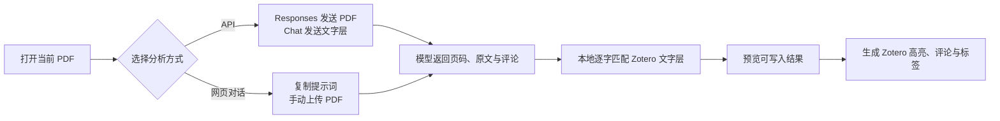

<div align="center">
  

  <h1>Margin Comments AI</h1>

  <p><strong>把 Zotero PDF 批注放回页面边缘，让 AI 像学者一样阅读与标注论文。</strong></p>

  <p>
    <a href="releases/margin-comments-ai-0.10.3.xpi"></a>
  </p>

  <p>
    
    
    
    <a href="LICENSE"></a>
  </p>

  <p>
    <a href="#-主要功能">主要功能</a> ·
    <a href="#-安装">安装</a> ·
    <a href="#-ai-学术标注">AI 标注</a> ·
    <a href="#-设置">设置</a> ·
    <a href="#-开发与构建">开发</a>
  </p>
</div>

---

## ✨ 项目简介

Margin Comments AI 将 Zotero 的高亮、下划线、便签、文字与区域批注显示为 PDF 页面两侧的可编辑卡片，并用引线连接原批注。评论直接保存回 Zotero，不修改 PDF 文件，也不建立额外批注数据库。

在此基础上，插件可以通过 API 或网页对话让大模型分析当前论文，把返回内容定位为真正的 Zotero 高亮批注。所有 AI 批注使用统一颜色和标签，后续可以使用 Zotero 原生筛选功能整体显示或隐藏。

> [!IMPORTANT]
> 当前版本面向 **Zotero 9.0.x**，并已按 Zotero 9.0.6 Reader 结构适配。

## 🚀 主要功能

| 页边阅读体验 | Zotero 原生协作 |
| --- | --- |
| 批注按页面位置自动分布到左右两侧 | 评论自动保存回原 Zotero 批注 |
| 引线从批注上边缘引出，避免遮挡正文 | 跟随颜色、标签和搜索筛选同步显隐 |
| 长评论三行预览，密集评论折叠并滚动 | 支持高亮、下划线、便签、文字和区域批注 |
| 悬停时卡片、引线和原批注同步浮起 | 点击卡片定位原批注，点击批注高亮卡片 |
| 缩放、旋转和页面重绘后保持对齐 | 支持浅色、深色与只读批注 |

### 📝 可直接编辑的页边评论

- 点击卡片即可选择、复制、粘贴和编辑文字。
- 停止输入约 700 ms 后自动保存，失焦时立即保存。
- `Ctrl/Cmd + Enter` 立即保存，`Esc` 取消尚未保存的编辑。
- 单侧评论超过页面高度时折叠为“还有 N 条”，展开后在当前页边栏内滚动。
- PDF 缩小到 80% 以下时自动收成一行预览，卡片字号不随缩放改变。

### 🎯 更稳的 Reader 布局

- 卡片挂载在 PDF.js 页面之外，缩放重绘时不会被 PDF.js 一并清除。
- 缩放期间复用现有卡片并逐帧同步位置，减少消失、闪烁和瞬时串位。
- 没有可显示旁注时不占用页面两侧空间，PDF 始终以页面中线为缩放中心。
- 原生便签图标可选缩小到 14px，点击框、拖动区域和引线锚点同步缩放。

> [!CAUTION]
> “缩小便签图标”依赖 Zotero Reader 的内部实现。如升级 Zotero 后出现点击或定位异常，请先关闭该选项。

## ✨ AI 学术标注

插件提供两条彼此独立的工作路径：

| API 模式 | 网页对话模式 |
| --- | --- |
| 在 Zotero 设置中填写兼容接口、密钥和模型 | 不在插件中填写 API Key |
| Responses 模式可发送 PDF；Chat 模式发送文字层 | 插件只复制任务提示词，用户自行在网页 AI 上传 PDF |
| 支持 SSE 流式返回和长论文分批处理 | 模型回复复制回剪贴板后由插件识别 |
| 适合自动化、可重复的标注流程 | 适合已有网页订阅或不稳定的兼容 API |

### AI 最终会写入什么？

- 物理 PDF 页码对应的逐字原文高亮；
- 面向研究方法、证据、结论、限制与学术价值的中文评论；
- 设置中指定的统一批注颜色；
- `AI 学术标注` 标签，方便整体筛选和隐藏。

模型结果不会直接盲写。插件会先在 Zotero 文字层中逐字匹配引文，只预览和写入定位可靠的结果，无法匹配的建议会被跳过。



### 长论文如何处理

Chat Completions 模式会把长论文按约 6.4 万字符拆成最多 8 个顺序请求，自动识别论文尾部的 References、Bibliography 或“参考文献”标题，并跳过其后的纯参考文献页。各批候选会交错合并，避免最终批注只集中在论文开头。

Responses 模式支持 PDF 文件输入，单个文件需小于 50 MB；Chat 模式不上传 PDF，只发送 Zotero 提取的带物理页码文字层。

## 📦 安装

### 1. 下载插件

[⬇️ 下载 `margin-comments-ai-0.10.3.xpi`](releases/margin-comments-ai-0.10.3.xpi)

仓库中的 [`releases/`](releases/) 目录保留了历史安装包。这里的安装包是普通仓库文件，不依赖 GitHub Release。

### 2. 安装到 Zotero

1. 打开 Zotero。
2. 进入“工具 → 插件”。
3. 点击右上角齿轮，选择“从文件安装插件”。
4. 选择刚下载的 `.xpi` 文件并按提示完成安装。
5. 打开任意 PDF，在 Reader 工具栏中使用页边批注与星光按钮。

## ⚡ 快速开始

### 使用页边批注

1. 在 PDF 中创建高亮、下划线或便签，并填写评论。
2. 评论会自动出现在离批注最近的页面边缘。
3. 点击卡片直接编辑，修改会自动保存回 Zotero。
4. 使用 Reader 工具栏按钮统一隐藏或恢复页边批注。

### 使用 API 标注

1. 打开“编辑 → 设置 → 页边批注 → AI 学术标注”。
2. 启用 AI，填写 API 地址、API Key 和模型名称。
3. 选择自动检测、Responses 或 Chat Completions，并测试连接。
4. 打开 PDF，点击工具栏星光按钮并确认发送。
5. 检查定位预览，确认后写入 Zotero。

### 使用网页对话

1. 在设置底部开启“用网页对话”。
2. 点击 Reader 星光按钮，插件会把本次任务提示词复制为纯文本。
3. 在网页 AI 中自行上传当前 PDF，粘贴提示词并发送。
4. 复制模型的完整回复；插件识别后会显示匹配与写入预览。

## ⚙️ 设置

设置入口位于“**编辑 → 设置 → 页边批注**”。修改会持久保存，并立即应用到所有已打开的 PDF。

- **显示的批注类型**：高亮、下划线、便签、文字、图片与区域。
- **阅读器外观**：可选将 Zotero 原生便签图标缩小到 14px。
- **AI 学术标注**：协议、API 地址、密钥、模型、统一颜色和每篇最多批注数。
- **补充标注要求**：在默认学者提示词之后追加研究重点。
- **网页对话**：不用 API，通过纯文本提示词和剪贴板结果完成标注。

## 🔐 隐私与边界

- 插件启动或打开 PDF 时不会自动请求外部服务；只有点击星光按钮并确认后才开始分析。
- API Key 保存在本机 Zotero 插件首选项中，不写入运行日志，但该位置不是操作系统密码保险库。
- Responses 模式使用远端文件时会在任务结束后尝试删除临时文件；最终数据策略仍取决于服务商。
- 网页对话模式不会复制 PDF，用户需要自行决定向哪个网页服务上传文件。
- 纯扫描 PDF、损坏文字层、模型改写引文或跨页引文可能无法可靠定位，因此不会强行写入。
- API 费用、数据保留、训练与地区政策由所选服务商决定，请在上传前自行确认。

## 🧩 兼容性

- **目标版本**：Zotero 9.0.x。
- **已适配环境**：Zotero 9.0.6。
- **API**：OpenAI Responses API、OpenAI 兼容的 `/chat/completions`，以及无需 API 的网页对话流程。
- **暂不支持**：Anthropic Messages、Gemini 原生协议、本地 OCR 和版面分析。

Reader 页面结构与坐标转换依赖 Zotero 内置 PDF.js，未来 Zotero 大版本更新后可能需要同步调整 `reader-adapter.ts`。

## 🛠️ 开发与构建

### 环境

- Node.js 22+
- pnpm
- PowerShell

### 构建命令

```powershell
corepack pnpm install
corepack pnpm run typecheck
corepack pnpm test
corepack pnpm run stress
corepack pnpm run build
corepack pnpm run verify:xpi
```

生成的 XPI 位于 `build/margin-comments-ai-0.10.3.xpi`，并会自动复制到 `releases/` 保留。常规测试目前包含 9 个测试文件、42 项测试。

## 📚 开发文档

- [AI 学术标注的数据流与可靠性边界](docs/ai-annotation.md)
- [Zotero 9.0.6 人工验收清单](docs/manual-smoke-test.md)
- [密集批注性能与压力测试](docs/performance.md)

## 🙏 参考与致谢

- [MuiseDestiny/zotero-gpt](https://github.com/MuiseDestiny/zotero-gpt)：README 信息层级与 Zotero AI 交互设计参考。
- [yilewang/llm-for-zotero](https://github.com/yilewang/llm-for-zotero)：当前论文上下文与 AI 阅读流程参考。
- [Zotero](https://www.zotero.org/)：批注数据、Reader 与 PDF 阅读体验。

## 📄 License

Copyright © 2026 XiaoDuComrade。

本项目使用 [GNU Affero General Public License v3.0 only](LICENSE)。如果你修改并传播本项目，或通过网络向用户提供修改版功能，需要按照 AGPL-3.0 的要求向相应用户提供对应源代码。
